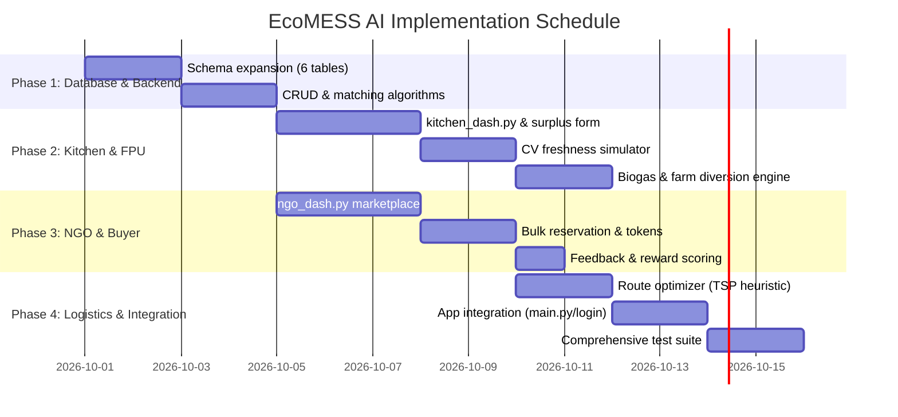

# EcoMESS AI — Implementation Plan: Kitchen/FPU, NGO, and Logistics Ecosystem

## Executive Summary
This document defines the architectural specification and step-by-step implementation plan for expanding **EcoMESS AI** with:
1. **Kitchen / Food Processing Units (FPUs) Module**: Surplus listing (free/discounted), CV quality verification, rewards ledger, and circular waste diversion (biogas/farms).
2. **NGO & Community Buyer Module**: Marketplace for subsidized individual orders and bulk NGO procurement, requirement-matching engine, and feedback rating.
3. **NGO Logistics Module**: Multi-kitchen pickup route optimization, distance/duration matrix, and scheduling before food freshness expires.
4. **Circular Economy Integration**: Direct pipeline to route unsold edible meals to biogas plants and raw vegetable scrap to local farms.

---

## 1. System Architecture & Information Flow

```mermaid
flowchart TD
    subgraph KitchenFPU ["Kitchens & FPUs (Seller / Donor)"]
        K1[Kitchen Staff / FPU Owner] -->|1. List Surplus / Near-Expiry| K2[Surplus Listing Engine]
        K2 -->|2. Quality Check| CV[CV Food Freshness Analyzer]
        CV -->|Pass: Safe Food| MKT[EcoMESS Surplus Marketplace]
        CV -->|Fail: Spoilage / Risk| DIV[Circular Waste Router]
        K1 -->|Track Metrics| K_DASH[FPU Dashboard & Eco-Points]
    end

    subgraph MarketplaceAndMatching ["Matching & Marketplace Layer"]
        MKT --> MATCH[Rule & Location Matching Engine]
        NGO_REQ[NGO Daily Capacity & Needs] --> MATCH
        MATCH -->|Recommend| N1[NGOs / Shelters / Food Banks]
        MKT -->|Browse Subsidized Items| B1[Local Individual Buyers]
    end

    subgraph LogisticsAndDelivery ["NGO Logistics Engine"]
        N1 -->|Reserve Multiple Kitchens| LOG[Multi-Stop Route Optimizer]
        LOG -->|Optimal Route & Pick-up Slots| DRV[Pickup Team / Van Driver]
        DRV -->|Collect & Transport| DIST[Beneficiary Distribution]
    end

    subgraph CircularEconomy ["Circular Economy Diversion"]
        DIV -->|Unsold / Expired Meals| BIO[Biogas Plant (Energy & Points)]
        DIV -->|Vegetable Peels & Scraps| FARM[Farms (Compost & Animal Feed)]
    end

    subgraph FeedbackRewards ["Feedback & Incentive System"]
        DIST -->|Post-Delivery Feedback| FB[Quality & Quantity Reviews]
        FB -->|Increases Score & Points| REW[Reward Points & Green Badges]
        REW --> K_DASH
    end
```

---

## 2. Database Schema Extensions (`database.py`)

To support these workflows, the relational schema in `ecomessdbms` will be expanded with the following 6 normalized tables:

### 2.1 Role Expansion in `users`
```sql
ALTER TABLE users 
MODIFY COLUMN role ENUM('student', 'staff', 'admin', 'kitchen_fpu', 'ngo', 'buyer') NOT NULL;
```

### 2.2 Table Definitions

```sql
-- 1. Surplus Food & Near-Expiry Listings
CREATE TABLE IF NOT EXISTS surplus_listings (
    id                INT AUTO_INCREMENT PRIMARY KEY,
    seller_id         INT NOT NULL,
    item_name         VARCHAR(150) NOT NULL,
    category          ENUM('cooked_meal', 'raw_produce', 'packaged_fpu', 'bakery') NOT NULL,
    total_quantity    DECIMAL(10,2) NOT NULL,
    available_qty     DECIMAL(10,2) NOT NULL,
    unit              VARCHAR(50) NOT NULL DEFAULT 'kg', -- 'kg', 'servings', 'packets'
    expiry_datetime   DATETIME NOT NULL,
    price_type        ENUM('free', 'discounted') NOT NULL DEFAULT 'free',
    original_price    DECIMAL(10,2) DEFAULT 0,
    discounted_price  DECIMAL(10,2) DEFAULT 0,
    location_address  VARCHAR(255) NOT NULL,
    latitude          DECIMAL(10,6) DEFAULT 0,
    longitude         DECIMAL(10,6) DEFAULT 0,
    quality_status    ENUM('pending_cv', 'verified_fresh', 'flagged_risk', 'expired') DEFAULT 'verified_fresh',
    quality_score     TINYINT DEFAULT 5, -- 1 to 5 based on freshness check
    status            ENUM('available', 'reserved', 'completed', 'diverted_biogas', 'diverted_farm') DEFAULT 'available',
    created_at        TIMESTAMP DEFAULT CURRENT_TIMESTAMP,
    FOREIGN KEY (seller_id) REFERENCES users(id) ON DELETE CASCADE
);

-- 2. Surplus Orders & Reservations (NGO Bulk + Individual Buyers)
CREATE TABLE IF NOT EXISTS surplus_orders (
    id                INT AUTO_INCREMENT PRIMARY KEY,
    listing_id        INT NOT NULL,
    buyer_id          INT NOT NULL,
    order_type        ENUM('ngo_bulk', 'individual') NOT NULL,
    quantity_ordered  DECIMAL(10,2) NOT NULL,
    total_price       DECIMAL(10,2) DEFAULT 0,
    pickup_slot       DATETIME NOT NULL,
    pickup_token      VARCHAR(20) NOT NULL UNIQUE,
    status            ENUM('requested', 'confirmed', 'picked_up', 'cancelled') DEFAULT 'confirmed',
    ordered_at        TIMESTAMP DEFAULT CURRENT_TIMESTAMP,
    FOREIGN KEY (listing_id) REFERENCES surplus_listings(id) ON DELETE CASCADE,
    FOREIGN KEY (buyer_id) REFERENCES users(id) ON DELETE CASCADE
);

-- 3. Feedback & Rating System (Increases Seller Eco-Score)
CREATE TABLE IF NOT EXISTS surplus_feedback (
    id                INT AUTO_INCREMENT PRIMARY KEY,
    order_id          INT NOT NULL UNIQUE,
    buyer_id          INT NOT NULL,
    seller_id         INT NOT NULL,
    rating            TINYINT NOT NULL, -- 1 to 5
    food_condition    ENUM('excellent', 'good', 'acceptable', 'poor') NOT NULL,
    quantity_accuracy BOOLEAN DEFAULT TRUE,
    comments          TEXT,
    points_awarded    INT DEFAULT 10,
    created_at        TIMESTAMP DEFAULT CURRENT_TIMESTAMP,
    FOREIGN KEY (order_id) REFERENCES surplus_orders(id) ON DELETE CASCADE,
    FOREIGN KEY (buyer_id) REFERENCES users(id) ON DELETE CASCADE,
    FOREIGN KEY (seller_id) REFERENCES users(id) ON DELETE CASCADE
);

-- 4. Reward Points & Gamification Ledger
CREATE TABLE IF NOT EXISTS reward_points (
    id                INT AUTO_INCREMENT PRIMARY KEY,
    user_id           INT NOT NULL,
    points            INT NOT NULL, -- positive for credit, negative for debit
    reason            ENUM('free_donation', 'high_rating_bonus', 'biogas_diversion', 'farm_diversion', 'redemption') NOT NULL,
    reference_id      INT DEFAULT NULL, -- order_id or diversion_id
    balance_after     INT NOT NULL,
    created_at        TIMESTAMP DEFAULT CURRENT_TIMESTAMP,
    FOREIGN KEY (user_id) REFERENCES users(id) ON DELETE CASCADE
);

-- 5. Circular Economy Waste Diversions (Biogas & Farm Waste)
CREATE TABLE IF NOT EXISTS circular_diversions (
    id                INT AUTO_INCREMENT PRIMARY KEY,
    kitchen_id        INT NOT NULL,
    waste_type        ENUM('unsold_cooked_food', 'spoiled_edible', 'vegetable_scraps', 'fpu_organic_sludge') NOT NULL,
    destination_type  ENUM('biogas_plant', 'organic_farm') NOT NULL,
    partner_name      VARCHAR(150) NOT NULL,
    quantity_kg       DECIMAL(10,2) NOT NULL,
    energy_points     INT DEFAULT 0,
    financial_credit  DECIMAL(10,2) DEFAULT 0,
    status            ENUM('scheduled', 'in_transit', 'processed') DEFAULT 'scheduled',
    created_at        TIMESTAMP DEFAULT CURRENT_TIMESTAMP,
    FOREIGN KEY (kitchen_id) REFERENCES users(id) ON DELETE CASCADE
);

-- 6. NGO Capacity & Requirement Profiles
CREATE TABLE IF NOT EXISTS ngo_profiles (
    id                INT AUTO_INCREMENT PRIMARY KEY,
    ngo_user_id       INT NOT NULL UNIQUE,
    organization_name VARCHAR(180) NOT NULL,
    daily_capacity    INT NOT NULL DEFAULT 100, -- people fed per day
    food_preference   ENUM('all', 'vegetarian_only', 'raw_produce_only') DEFAULT 'all',
    operating_radius  DECIMAL(5,2) DEFAULT 15.0, -- km
    operating_area    VARCHAR(200) NOT NULL,
    vehicle_available ENUM('van', 'mini_truck', 'two_wheeler', 'none') DEFAULT 'van',
    contact_phone     VARCHAR(30),
    FOREIGN KEY (ngo_user_id) REFERENCES users(id) ON DELETE CASCADE
);
```

---

## 3. Module Specifications & UI Design

### 3.1 Kitchen / Food Processing Unit (FPU) Module (`kitchen_dash.py`)
**User Persona**: Hostel Head Chef, Mess Contractor, FPU Production Manager.

* **Tabs & Core Features**:
  1. **Surplus Listing Studio**:
     - Fast entry: Item name, quantity (servings/kg), time cooked, safe-until timestamp.
     - Pricing model toggle: Free donation (for shelters/NGOs) or Discounted (₹10–₹30/portion for individuals).
     - Automated tagger: Highlights allergen & dietary markers (Veg / Non-Veg / Vegan).
  2. **Computer Vision (CV) Quality Verification**:
     - Image inspection widget: Kitchen uploads food tray photo.
     - OpenCV / CNN simulation: Analyzes color histogram, visual consistency, and steam/freshness markers, generating a `Freshness Score (85%-100%)` and `Safe to Distribute` certificate badge.
  3. **Live Orders & Dispatch**:
     - View incoming NGO bulk reservations and individual orders.
     - 4-digit pickup code verification prevents incorrect food handover.
  4. **Circular Waste Diversion (Biogas & Farm Portal)**:
     - If food nears the expiry boundary without a buyer, an automatic alert triggers:
       - **Action A**: `Dispatch to GreenPower Biogas Plant` → Converts 25 kg cooked food into 4.2 $m^3$ bio-methane + 120 Energy Points.
       - **Action B**: `Dispatch to AgroGreen Farm` → Converts 40 kg vegetable peelings into cattle feed / organic compost + ₹150 credit.
  5. **Reward Points & Sustainability Leaderboard**:
     - View total points balance, national sustainability rank, and tax/CSR donation receipts.

---

### 3.2 NGO & Community Buyer Module (`ngo_dash.py`)
**User Persona**: NGO Volunteer Coordinator, Shelter Food Manager, Subsidized Meal Buyer.

* **Tabs & Core Features**:
  1. **Surplus Marketplace**:
     - Card view displaying all available food nearby with countdown timer: *"Expires in 2h 45m"*.
     - Filters: Distance (< 5km, < 10km), Meal Type (Breakfast, Lunch, Dinner, Raw Veg), Price (Free / Paid).
     - One-click **"Reserve Bulk for Shelter"** (NGO) or **"Buy Subsidized Meal"** (Individual).
  2. **Smart Requirement Matching**:
     - System automatically flags matches: *"Kitchen A (Hostel 3) has 60 portions of Rice & Dal matching your daily capacity of 100 meals (2.3 km away)"*.
  3. **My Pickups & Token Generator**:
     - Shows active reservations, digital pickup token, QR/Barcode, and kitchen emergency contact.
  4. **Feedback & Quality Rating Form**:
     - Upon pickup completion, the NGO rates food temperature, taste, cleanliness, and portion match.
     - Submitting a review awards bonus reward points to the kitchen owner.

---

### 3.3 Logistics & Multi-Stop Route Optimizer (`logistics_engine.py`)
**Role Responsibility**: The NGO manages their pickup logistics.

* **Capabilities**:
  1. **Multi-Stop Route Construction**:
     - If an NGO reserves surplus from 2 hostels and 1 FPU in the same evening, the logistics engine runs a Travelling Salesperson / Nearest-Neighbor heuristic:
       $$\text{Start (NGO Base)} \longrightarrow \text{Hostel A} \longrightarrow \text{FPU B} \longrightarrow \text{Hostel C} \longrightarrow \text{Distribution Point}$$
  2. **Freshness Window Constraint**:
     - The algorithm verifies that total trip duration + pickup handling ($\le 45\text{ mins}$) finishes well before the earliest food expiry timestamp.
  3. **Visual Route Display**:
     - Tkinter Canvas route map rendering waypoints, distance (km), estimated transit time, and turn-by-turn guidance notes.

---

## 4. Implementation Steps & Timeline



### Detailed Execution Tasks

#### Task 1: Database Migration (`database.py`)
- Add schema creation scripts for `surplus_listings`, `surplus_orders`, `surplus_feedback`, `reward_points`, `circular_diversions`, `ngo_profiles`.
- Implement API functions:
  - `add_surplus_listing()`, `get_active_surplus_listings()`, `reserve_surplus_order()`
  - `add_order_feedback()`, `get_user_reward_points()`, `record_waste_diversion()`
  - `get_ngo_profile()`, `find_matching_surplus_for_ngo()`

#### Task 2: Build `kitchen_dash.py`
- Create `KitchenDashboard(ttk.Frame)` with 5 dedicated tabs:
  1. *Post Surplus & CV Inspect* (image upload, freshness check, submit listing)
  2. *Active Listings & Pickups* (live status tracker, verify pickup tokens)
  3. *Circular Waste Diversion* (send to Biogas / Farm)
  4. *Rewards & Impact Ledger* (points, carbon offset metrics, meals saved)
  5. *User Manual*

#### Task 3: Build `ngo_dash.py`
- Create `NgoDashboard(ttk.Frame)` with 4 tabs:
  1. *Surplus Marketplace* (browse, search, filter, reserve)
  2. *Logistics & Route Planner* (multi-stop route optimizer with map canvas)
  3. *My Orders & Verifications* (pickup tokens, verification status)
  4. *Rate & Review* (post-delivery feedback)

#### Task 4: Logistics Route Optimizer (`logistics_engine.py`)
- Implement Haversine distance matrix calculator between geo-coordinates.
- Implement Greedy Nearest-Neighbor pickup tour planner prioritizing shortest pickup time and earliest expiry deadline.

#### Task 5: App Integration & Seed Data
- Update [login_page.py](file:///c:/Users/GKM701/OneDrive/Desktop/sih/login_page.py) and [main.py](file:///c:/Users/GKM701/OneDrive/Desktop/sih/main.py) to add `Kitchen / FPU` and `NGO` roles.
- Update [seed_data.py](file:///c:/Users/GKM701/OneDrive/Desktop/sih/seed_data.py) with sample FPUs, NGOs, biogas plants, farms, active surplus batches, and route simulations.
- Create automated test file `test_kitchen_ngo_features.py`.

---

## 5. Verification & Testing Plan

### Automated Test Cases (`test_kitchen_ngo_features.py`)
1. **Surplus Lifecycle**: Post surplus $\rightarrow$ Reserve by NGO $\rightarrow$ Confirm pickup $\rightarrow$ Verify stock drops to 0.
2. **Double-Booking Guard**: Attempt concurrent over-reservation on a 20 kg batch $\rightarrow$ Validate rejection.
3. **Reward Points Integrity**: Check that completing a free donation adds $+50$ points and 5-star review adds $+20$ points to seller ledger.
4. **Biogas/Farm Diversion**: Trigger circular diversion on expired batch $\rightarrow$ Verify listing marks `diverted_biogas` and logs energy credit.
5. **Route Calculation**: Pass 3 kitchen pickup waypoints $\rightarrow$ Validate sequence orders them logically with valid ETA.
