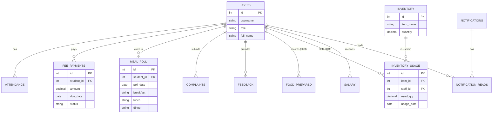

# Project Report: EcoMess Management System

## 1. ABSTRACT
The **EcoMess** application is a comprehensive, desktop-based Hostel Mess Management System designed to digitize and streamline the daily operations of a student mess. The system caters to three primary user roles: Administrators, Staff, and Students. It dynamically manages menu scheduling, user attendance, real-time polling for daily meals, inventory administration, dynamic mess bill generation based on consumption, and a student feedback system. By integrating these interconnected modules into a centralized platform, EcoMess significantly reduces food wastage, automates structured financial tracking, and improves the overall dining experience and transparency for students.

## 2. INTRODUCTION
Managing a typical university or hostel mess relies heavily on manual record-keeping, leading to systemic inefficiencies such as substantial food wastage due to inaccurate headcounts, opaque billing mechanisms, and a lack of organized feedback loops. 

**EcoMess** addresses these operational challenges by offering an automated platform. Students are empowered to vote on their daily meals, view weekly menus, track their dynamically calculated mess bills, and submit direct feedback. Staff members utilize the system to monitor accurate daily meal counts, record food preparation and wastage, and manage raw material inventory. Administrators oversee the entire operation by handling user credentials, managing staff salaries, broadcasting system-wide notifications, and reviewing critical analytics to optimize operations.

## 3. PROBLEM DESCRIPTION
Traditional mess management approaches face several critical issues:
1. **High Food Wastage:** The lack of an accurate daily headcount results in the over-preparation of food and substantial material loss.
2. **Inaccurate and Rigid Billing:** Flat-rate or manually calculated bills do not accurately reflect the actual consumption of individual students, leading to financial disputes.
3. **Inventory Mismanagement:** Poor tracking of stock levels and daily ingredient usage frequently causes unexpected supply shortages.
4. **Communication Gaps:** Difficulty in quickly broadcasting menu changes, critical notices, or handling student grievances efficiently.
5. **Slow Feedback Loop:** No structured, quantifiable method for students to provide immediate feedback on meal quality or service.

## 4. REQUIREMENT ANALYSIS

### 4.1 Functional Requirements
* **User Authentication & Role Management:** Secure login portals and separate, functionally distinct dashboards for Admin, Staff, and Student roles.
* **Granular Polling System:** Students must be able to securely opt-in or out for each specific meal (Breakfast, Lunch, Snacks, Dinner) on a daily basis.
* **Dynamic Financial Billing:** Auto-generation of monthly student mess bills based strictly on the specific meals they polled for, alongside automated late-fee calculation logic.
* **Inventory Control:** Staff capabilities to add, update stock levels, and meticulously log daily inventory usage.
* **Feedback & Complaint Management:** Modules allowing students to rate historical meals (out of 5 stars) and submit detailed complaints for administrative review.
* **Attendance & Human Resources:** System for tracking staff/student attendance and processing monthly employee salaries.
* **Menu Management:** Administrative control to set, edit, and broadcast the weekly dining menu to all users.

### 4.2 Non-Functional Requirements
* **Reliability:** The system must maintain strict data integrity for all financial calculations, inventory figures, and voting records.
* **Usability:** Provide highly intuitive, responsive user interfaces minimizing the learning curve for non-technical staff and students.
* **Security:** Secure SQL querying paradigms to prevent injection attacks and ensure strict data isolation between user roles.

## 5. ER DIAGRAM
The following Mermaid diagram represents the Entity-Relationship flow of the EcoMess database.

## 6. RELATIONAL SCHEMA
The database (`ecomessdbms`) is mapped via the following normalized relational schemas:

* **`users`** (`id` PK, `username` UNIQUE, `password`, `role`, `full_name`, `email`, `created_at`)
* **`attendance`** (`id` PK, `user_id` FK, `att_date`, `check_in`, `check_out`, `status`)
* **`menu`** (`id` PK, `week_start_date`, `day_of_week`, `meal_type`, `items`)
* **`fee_payments`** (`id` PK, `student_id` FK, `month`, `year`, `amount`, `fine`, `due_date`, `payment_date`, `status`)
* **`poll` / `meal_poll`** (`id` PK, `student_id` FK, `poll_date`, `breakfast`, `lunch`, `snacks`, `dinner`)
* **`feedback`** (`id` PK, `student_id` FK, `rating`, `comment`, `created_at`)
* **`complaints`** (`id` PK, `user_id` FK, `message`, `status`, `created_at`)
* **`notifications`** (`id` PK, `title`, `message`, `target_role`, `created_at`)
* **`notification_reads`** (`id` PK, `notification_id` FK, `user_id` FK, `read_at`)
* **`inventory`** (`id` PK, `item_name` UNIQUE, `quantity`, `unit`, `updated_at`)
* **`inventory_usage`** (`id` PK, `staff_id` FK, `item_id` FK, `used_qty`, `usage_date`, `note`, `used_at`)
* **`food_prepared` & `food_waste`** (`id` PK, `staff_id` FK, `date`, `item_name`, `quantity`, `meal_type`)
* **`salary`** (`id` PK, `user_id` FK, `month`, `year`, `amount`, `paid_date`, `status`)
* **`user_manual`** (`id` PK, `role` UNIQUE, `content`)

## 7. IMPLEMENTATION DETAILS
* **Frontend Application Client:** The interface is engineered natively in Python, utilizing UI libraries (`Tkinter` or similar) to compile a rich desktop graphical user environment containing uniquely partitioned modules for the `Admin`, `Staff`, and `Student` users.
* **Backend Logic & Data Bridging:** A robust Python backend acts as the controller, managing all core business policies—ranging from dynamically projecting the user's monthly mess fee based on historic poll presence, executing complex query validations, and securing active sessions.
* **Database Management:** EcoMess is powered centrally by a `MySQL` relational database. Operations are processed via the `mysql-connector-python` API layer utilizing normalized parameterization to strictly negate injection attempts and ensure data persistence.
* **Dynamic Billing Algorithm:** The financial controller parses all `meal_poll` records for a student across the given month, multiplying itemized attendances strictly by dynamic meal constants (e.g., Breakfast: ₹40, Lunch: ₹60), and automatically injects dynamically scaling lateness fines directly into the `fee_payments` records without manual intervention.

## 8. CONCLUSION
The EcoMess System emphatically modernizes the inherently complex operational workflow of a traditional hostel mess. Unifying granular user management, algorithmic food tracking, structured feedback systems, and transparent financial operations into one suite successfully addresses the pain points of administration. 

Implementing features like explicit itemized voting (meal polls) and daily inventory logging decisively curtails structural food waste while delivering a fully robust, pay-per-use equivalent billing environment specifically tailored for the student body. The modular nature of this architecture simultaneously establishes a highly scalable foundation for extensive future analytical enhancements, including ML-trained demand prediction mapping and automated external supply chain routing.
